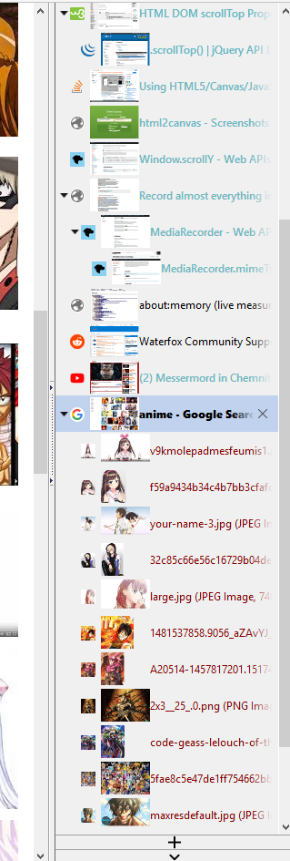

# TabThumbNailOverlay
firefox addon, which puts small thumbnails of the tab content into the tab ui 

primarily its meant as an extension to "tree style tabs" the legacy version ...

features:

- uses minimal canvas downscaling method 
- i hooked the Sessionstore.jsm so it should even be compatible with webext session managers 
- images are saved and loaded the tab session attributes 
- i now made it compatible with sessionmanager and normal session-restore .. 

-limitations :

it will only work completely with e10s(mutliprocessing / remote tabs) , i dont want to build in fixes for noremote 

---

the idea came from the an old addon "informational tabs" , but that thing was seriously bloated.

so i rewrote the functionality i needed (tab thumbnails) into an efficient addon which uses almost no ressources and doesnt mess with firefox too much 
